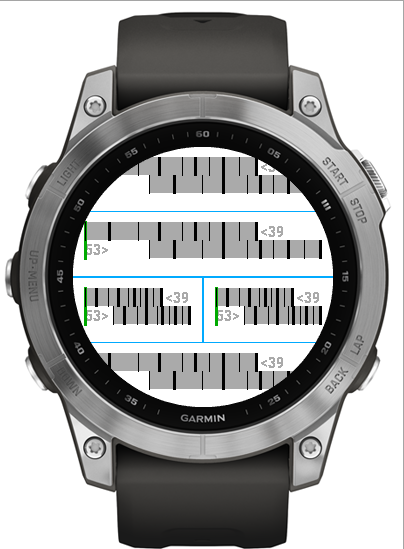

Display estimated current gear ratio.  Ratio is calulated from speed, cadence
and wheel-circumfrence (see settings).  Cog sizes are used to mark a gauge
display of ratio.  No appempt is made to guess which cogs are in use.

Ratio and meters of development are logged to the current activy.

Inspired by:
* https://www.gear-calculator.com/
* https://apps.garmin.com/en-US/apps/f4892c5c-77e1-46cd-b4ef-3f8f94c7d6c3

Based on:
* https://github.com/clementbarthes/GarminCogDisplay

